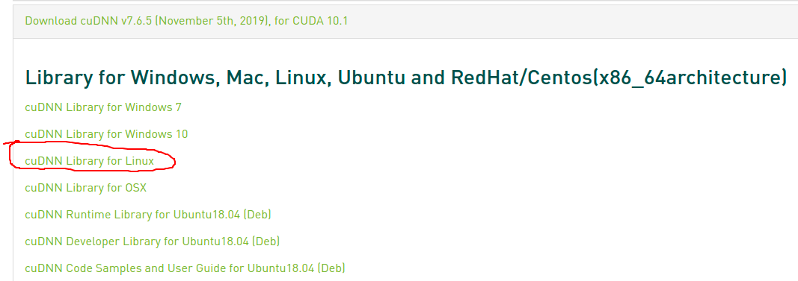

### Starting issue - After running a .py file containing a TensorFlow training code I was getting the following error.

```
Ubuntu 20.04 NVDIA cuda Could not load dynamic library 'libcudnn.so.7'; dlerror: libcudnn.so.7
```

Followed this [askubuntu](https://askubuntu.com/questions/1230645/when-is-cuda-gonna-be-released-for-ubuntu-20-04)

**NOTE - For Cuda only, follow my other note as not Ubuntu 20.04's cuda package has been released.**

So I have already followed the above process and now running

`nvcc -V` correctly gives me

```
nvcc: NVIDIA (R) Cuda compiler driver
Copyright (c) 2005-2019 NVIDIA Corporation
Built on Sun_Jul_28_19:07:16_PDT_2019
Cuda compilation tools, release 10.1, V10.1.243

```

Then running `dpkg -l | grep cuda-toolkit` correctly gives me

```
ii  cuda-toolkit-11-0                             11.0.2-1                                  amd64        CUDA Toolkit 11.0 meta-package
ii  nvidia-cuda-toolkit                           10.1.243-3                                amd64        NVIDIA CUDA development toolkit

```

AND also `cat /usr/local/cuda/version.txt` correctly gives me

`CUDA Version 11.0.207`

**NOW the most important step - Install cuDNN (7.6.5) - This is what I did on 25-July-2020**

First go to **[this official link][3]** then choose _Download cuDNN_. You'll be asked to login/create an account. After logging in and customary acceptance of _the Terms of the cuDNN Software License Agreement_.

A list of downloadable cuDNN will be displayed > Expand the section for **Download cuDNN v7.6.5 (November 5th, 2019), for CUDA 10.1** . Remember

(November 5th, 2019), for CUDA 10.1* then choose \_cuDNN Library for Linux*.



After the download is finished, extract the file, then open the terminal and run:

    cd cudnn-10.1-linux-x64-v7.6.5.32 # or whatever folder you got after extracting the file

Then:

    sudo cp cuda/include/cudnn.h /usr/lib/cuda/include/

After that:

    sudo cp cuda/lib64/libcudnn* /usr/lib/cuda/lib64/

Finally:

    sudo chmod a+r /usr/lib/cuda/include/cudnn.h /usr/lib/cuda/lib64/libcudnn*

Once you finish, you have to add the CUDA path to your `~/.bashrc` file. You need to run:

    echo 'export LD_LIBRARY_PATH=/usr/lib/cuda/lib64:$LD_LIBRARY_PATH' >> ~/.bashrc
    echo 'export LD_LIBRARY_PATH=/usr/lib/cuda/include:$LD_LIBRARY_PATH' >> ~/.bashrc

Then run:

    source ~/.bashrc

**3- Optional:**
Now you can install Tensorflow-gpu (2.2.0) and test if uses your GPU or not.
pip3 install tensorflow-gpu==2.2.0
Then run `python3` and type the following lines:

    import tensorflow as tf
    tf.config.list_physical_devices('GPU')

If everything went as planned, you'll get an output telling that Tensorflow has access to your GPU.

[1]: https://askubuntu.com/users/263979/meetnick
[2]: https://askubuntu.com/a/1231356/822295
[3]: https://developer.nvidia.com/rdp/form/cudnn-download-survey
