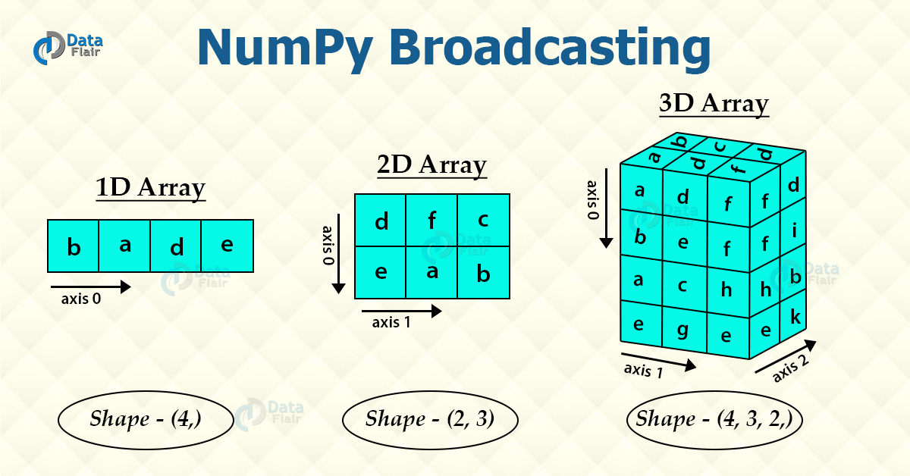
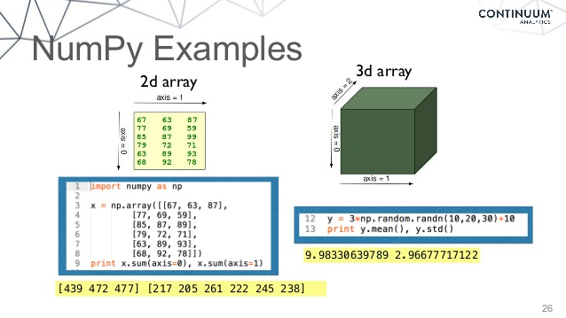
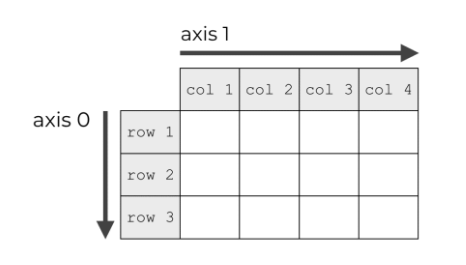
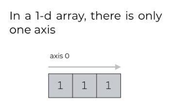

## What may make more sense from a pure programming perspective of action on array elements :

### Axis 0 will act on all the ROWS in each COLUMN

### Axis 1 will act on all the COLUMNS in each ROW

### So a `mean` on axis 0 will be the mean of all the rows in each column, and a mean on axis 1 will be a mean of all the columns in each row.

---

```python
import numpy as np

x = 10
print('Dimension of x is ', np.ndim(x))
# Dimension of x is  0
```

Then

```python
x = [10]
print('Dimension of x is ', np.ndim(x))
# Dimension of x is  1

```

Then add more elements to the array

```python

x = [10, 20, 30 ]
print('Dimension of x is ', np.ndim(x))
# Dimension of x is  1

```

Dimension is still 1

Now

```python

x = [[10, 20, 30 ],
     [40, 50, 60 ],
     [70, 80, 90 ]

]
print('Dimension of x is ', np.ndim(x))
# Dimension of x is  2

```

And now its 2. This is a 2-D array with 3 rows and 3 columns. It has two axis.

---

In numpy arrays, dimensionality refers to the number of axes needed to index it, not the dimensionality of any geometrical space. For example, you can describe the locations of points in 3D space with a 2D array:

```
array([[0, 0, 0],
       [1, 2, 3],
       [2, 2, 2],
       [9, 9, 9]])
```

Which has shape of (4, 3) and dimension 2. But it can describe 3D space because the length of each row (axis 1) is three, so each row can be the x, y, and z component of a point's location.

---

#### From Numpy's tutorial, axis can be indexed with integers, like 0 is for column, 1 is for row.

By definition, the axis number of the dimension is the index of that dimension within the array's `shape`. It is also the position used to access that dimension during indexing.

For example, if a 2D array `a` has shape (5,6), then you can access `a[0,0]` up to `a[4,5]`. Axis 0 is thus the first dimension (the "rows"), and axis 1 is the second dimension (the "columns"). In higher dimensions, where "row" and "column" stop really making sense, try to think of the axes in terms of the shapes and indices involved.

## Source - https://stackoverflow.com/a/17079437/1902852



---



---

#### NUMPY AXES ARE LIKE AXES IN A COORDINATE SYSTEM

https://www.sharpsightlabs.com/blog/numpy-axes-explained/

So if we have a point at position (2, 3), we’re basically saying that it lies 2 units along the x axis and 3 units along the y axis.


---

#### NUMPY AXES ARE THE DIRECTIONS ALONG THE ROWS AND COLUMNS

Just like coordinate systems, NumPy arrays also have axes.



In a 2-dimensional NumPy array, the axes are the directions along the rows and columns.

---

#### Here is the documentation:

In Numpy dimensions are called axes. The number of axes is rank. For example, the coordinates of a point in 3D space [1, 2, 1] is an array of rank 1, because it has one axis. That axis has a length of 3.

https://stackoverflow.com/a/19390939/1902852

In numpy arrays, dimensionality refers to the number of axes needed to index it, not the dimensionality of any geometrical space. For example, you can describe the locations of points in 3D space with a 2D array:

```
array([[0, 0, 0],
       [1, 2, 3],
       [2, 2, 2],
       [9, 9, 9]])
```

Which has shape of (4, 3) and dimension 2. But it can describe 3D space because the length of each row (axis 1) is three, so each row can be the x, y, and z component of a point's location. The length of axis 0 indicates the number of points (here, 4). However, that is more of an application to the math that the code is describing, not an attribute of the array itself. In mathematics, the dimension of a vector would be its length (e.g., x, y, and z components of a 3d vector), but in numpy, any "vector" is really just considered a 1d array of varying length. The array doesn't care what the dimension of the space (if any) being described is.

##### 1-dimensional NumPy arrays e.g. [0 1 2 3 4 5 6 7 8] only have one axis.



```python
import numpy as np

a = np.arange(9)
print(a)

# [0 1 2 3 4 5 6 7 8]

print(a.ndim)  # number of dimensions
# 1

print(a.shape)
# (9,)

b = np.array([[0,0,0],[1,2,3],[2,2,2],[9,9,9]])
print(b.ndim)
# 2

```
